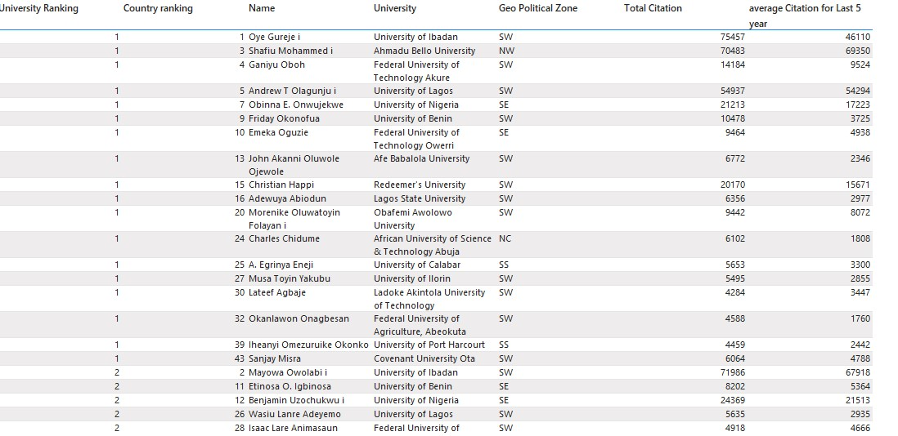
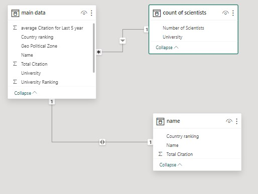

# Nigeria's Top 50 Scientists

## Introduction
In August of 2021, I analyzed the top 50 scientists in Nigeria. My goal was to figure out how scientists were distributed around the nation. I was interested in learning if the country's top 50 scientists are  evenly distributed geographically, and if not, which schools produce the greatest amount of internationally recognized scientists and which areas have the highest levels of education.

## Key Objectives
1.	What school has the largest number of world recognized scientists
2.	Who was the most recognized Scientist
3.	What Schools have the least number of globally Recognized Scientists 
4.	Which schools have scientists with the largest number of citations

## Skills Demonstrated
-	Data Cleaning
-	Data modelling 
-	Data Visualization
-	Data cleaning with Excel
-	Modelling and visualizations with power BI

## Data Sourcing
The data was gotten from AD Scientific index. A website that was created to record the current standings of scientists globally you can visit the Website here: . I filtered the data at the source to get only data from Nigeria since I learned that data should be queried and cleaned as far upstream as possible to reduce the model size better optimizing the model making it more performant. 

## Data Cleaning

I Used excel to clean the data and Power Bi for the modelling and Visualization. This was way before I learnt to use power bi for data transformations. Thankfully, The data didn’t really need much cleaning since it was already a html table. All I had to do was to define my data types. Then I did a little bit of cleaning to remove the txt errors and unprintable text using a combination of CLEAN and TRIM formulas in Excel. I also had to do a bit of data aggregation using the COUNTIF formula (again, this was before I learnt to use power query effectively lol) to get the total number of scientists per university and region. 

## Modelling

I used the Star Schema as a modelling template to build the model. I used a 1 to many and 1 to 1 relationship in the model. Now that I think about it, maybe I’ll just merge the two tables with 1-1 relationship following best practices.

## Visualization and Analysis

Since this was a visualization that was made to compare different attributes, I decided to keep it simple with cards, column charts and tables. As this are some of the best visuals for this purpose. I followed the 60-30-10 rule of visualization which says that 60% of your color scheme should serve as the focal point of the visuals and  should be as unobtrusive as possible (I chose light grey for this), 30% of the color scheme should create contrast against the background color (I chose black for this), and 10% should be used to draw attention (I used dark green for this).

### Analysis

I based my decision of the most recognized scientist on the total number of citations the individual has.
- In this case, the most recognized Nigerian scientist in 2021 had over 100,000 citations to his name. 
- A majority of the top 50 recognized scientists in Nigeria work in the Southwest of the country with the university of Ife having 14 of them as permanent staff and over 200,000 citations in total accounting for - over 60% of the total citations from the region. 
- I also found that the northwest has the least number of citations.

## Conclusion

This project proved a public opinion that the southwest has some of the most educated individuals while the north has the last. 
I believe research funding, publishing support and more advanced research methodologies can go a long way in improving this number. 
with my current knowledge, maybe I’ll rework this project and instead of importing the dataset, ill just make a live connection to the website so I can keep the dashboard updated at all times.
You can view the document in PDF format [here](topscientists.pdf)

